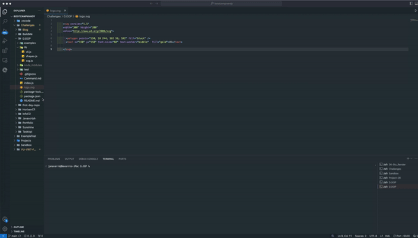

## Challenge 10 : OOP File Homework

## View Project
* [View Link](https://drive.google.com/file/d/1c2IgodC55b12W_dyusHt00DHp6ktYfBK/view?usp=sharing)

## Table of Contents
* [License](#license)
* [Description](#description)
* [Installation](#installation)
* [Usage](#usage)
* [Contributing](#contributing)
* [Test](#test)
* [Questions](#questions)

## License 

## Description
The object for this assignment is to create a SVG file through the process of OOP and utilizing javascript to input the code, while inputting key add-in like npm start.

## Installation 
NPM, gitignore.

## Usage 
The output of this file is in javascript and is created as a SVG.

## Contributing 
The purpose of this file is to help create a SVG file | Issue: Please use terminal for any issues | Review: Code will be reviewed through Edx Central Grader | License and copyright: N/A .

## Test
Open folder, Open Integrated Terminal (Or Use Terminal), Utilize Node, Follow Prompts

## Questions
Github: One4TheNation
Email: pnnavarre@gmail.com
